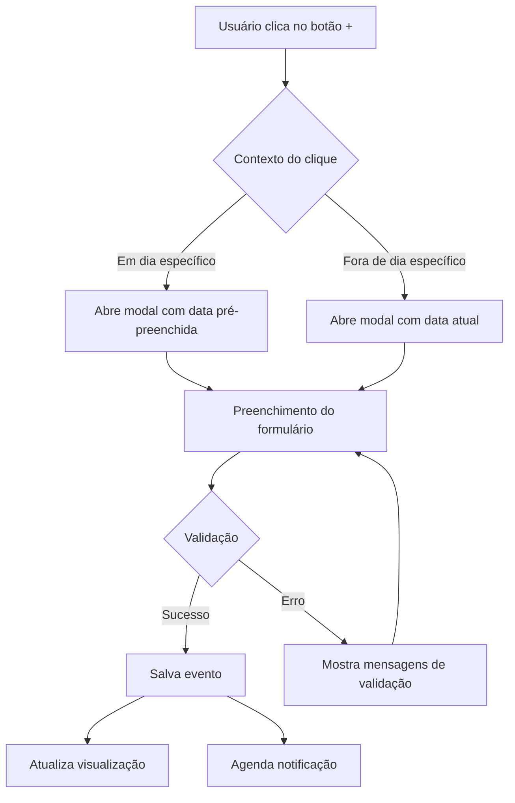
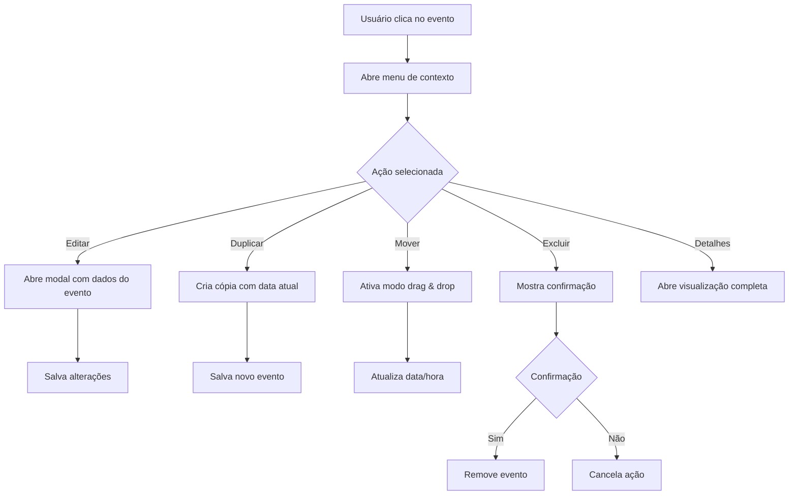
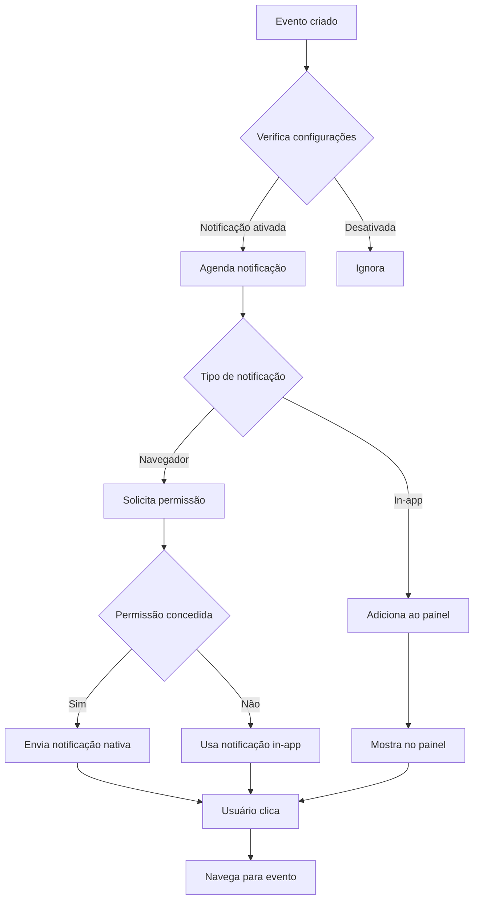

# Arquitetura do Sistema de Calendário MaxNote

## Análise da Estrutura Atual

### Pontos Fortes Identificados
- Interface limpa e intuitiva com Tailwind CSS
- Estrutura básica funcional com visualização mensal
- Sistema de eventos com categorias e cores
- Integração com o sistema de temas do MaxNote
- Componentes reutilizáveis e bem organizados

### Pontos de Melhoria Identificados
- Código monolítico no componente Calendar.tsx (630 linhas)
- Falta de visualizações semanal e diária funcionais
- Gerenciamento de estado complexo com múltiplos useState
- Ausência de persistência de dados
- Modal de eventos limitado
- Sem recursos avançados (drag & drop, notificações, etc.)

## Arquitetura de Componentes Proposta

### 1. Estrutura de Diretórios
```
src/
├── components/
│   ├── calendar/
│   │   ├── CalendarView.tsx          # Componente principal
│   │   ├── views/
│   │   │   ├── MonthView.tsx         # Visualização mensal
│   │   │   ├── WeekView.tsx          # Visualização semanal
│   │   │   └── DayView.tsx           # Visualização diária
│   │   ├── components/
│   │   │   ├── EventCard.tsx         # Card de evento
│   │   │   ├── EventModal.tsx        # Modal de criação/edição
│   │   │   ├── EventForm.tsx         # Formulário de evento
│   │   │   ├── QuickAddButton.tsx    # Botão de adição rápida
│   │   │   ├── ViewSwitcher.tsx      # Seletor de visualização
│   │   │   ├── DateNavigator.tsx     # Navegação de datas
│   │   │   ├── EventActions.tsx      # Ações do evento
│   │   │   ├── NotificationPanel.tsx # Painel de notificações
│   │   │   └── SearchFilter.tsx      # Busca e filtros
│   │   ├── hooks/
│   │   │   ├── useCalendar.tsx       # Hook principal do calendário
│   │   │   ├── useEvents.tsx         # Hook para gerenciar eventos
│   │   │   ├── useNotifications.tsx  # Hook para notificações
│   │   │   └── useDragDrop.tsx       # Hook para drag & drop
│   │   ├── utils/
│   │   │   ├── dateHelpers.ts        # Utilitários de datas
│   │   │   ├── eventHelpers.ts       # Utilitários de eventos
│   │   │   └── storageHelpers.ts     # Utilitários de armazenamento
│   │   └── types/
│   │       ├── Event.ts              # Tipos de eventos
│   │       ├── Calendar.ts           # Tipos do calendário
│   │       └── Notification.ts       # Tipos de notificações
├── context/
│   └── CalendarContext.tsx           # Contexto do calendário
└── services/
    ├── calendarService.ts             # Serviços de calendário
    ├── notificationService.ts        # Serviços de notificação
    └── integrationService.ts         # Integração com outros módulos
```

### 2. Responsabilidades dos Componentes

#### CalendarView.tsx (Componente Principal)
- Orquestrar todos os subcomponentes
- Gerenciar estado global da visualização
- Coordenar interações entre componentes
- Implementar lógica de roteamento interno

#### Views (MonthView, WeekView, DayView)
- Renderizar eventos na visualização específica
- Gerenciar layout responsivo
- Implementar navegação entre períodos
- Detectar conflitos de horários

#### EventModal.tsx
- Gerenciar estado de abertura/fechamento
- Implementar animações e transições
- Coordenar com EventForm
- Tratar acessibilidade (focus trap)

#### EventForm.tsx
- Validação de formulário
- Gerenciamento de estado dos campos
- Integração com sistema de recorrência
- Suporte a anexos e links

#### Hooks Especializados
- **useCalendar**: Gerenciar navegação e visualizações
- **useEvents**: CRUD de eventos, filtros, busca
- **useNotifications**: Sistema de notificações
- **useDragDrop**: Funcionalidade de arrastar e soltar

## Sistema de Estado e Persistência

### 1. Arquitetura de Estado
```typescript
// Estado centralizado no CalendarContext
interface CalendarState {
  // Navegação e visualização
  currentDate: Date;
  currentView: 'month' | 'week' | 'day';
  selectedDate: Date | null;
  
  // Eventos
  events: Event[];
  filteredEvents: Event[];
  selectedEvent: Event | null;
  
  // UI State
  isModalOpen: boolean;
  isCreating: boolean;
  isEditing: boolean;
  
  // Filtros e busca
  searchQuery: string;
  activeFilters: EventFilter[];
  
  // Notificações
  notifications: Notification[];
  notificationSettings: NotificationSettings;
}
```

### 2. Estratégia de Persistência
```typescript
// Sistema de persistência local com localStorage
interface StorageService {
  // Eventos
  saveEvents(events: Event[]): void;
  loadEvents(): Event[];
  
  // Configurações
  saveSettings(settings: CalendarSettings): void;
  loadSettings(): CalendarSettings;
  
  // Cache para performance
  cacheEvents(dateRange: DateRange, events: Event[]): void;
  getCachedEvents(dateRange: DateRange): Event[] | null;
}
```

### 3. Sincronização com Outros Módulos
```typescript
// Interface de integração
interface ModuleIntegration {
  // Com tarefas
  syncWithTasks(): Promise<void>;
  convertTaskToEvent(task: Task): Event;
  
  // Com notas
  createNoteFromEvent(event: Event): Note;
  linkEventToNote(eventId: string, noteId: string): void;
  
  // Com tags
  syncTags(calendarTags: string[], globalTags: string[]): string[];
}
```

## Interface do Usuário e Fluxos de Interação

### 1. Fluxo Principal de Criação de Eventos


### 2. Fluxo de Edição e Gerenciamento


### 3. Sistema de Notificações


## Tecnologias e Bibliotecas Recomendadas

### 1. Dependências Principais
```json
{
  "dependencies": {
    "date-fns": "^4.1.0",           // Manipulação de datas
    "react-beautiful-dnd": "^13.1.1", // Drag & drop
    "react-hot-toast": "^2.4.1",     // Notificações
    "framer-motion": "^10.16.4",     // Animações
    "react-use": "^17.4.0",          // Hooks utilitários
    "uuid": "^9.0.1"                 // Geração de IDs únicos
  }
}
```

### 2. Tipos de Dados
```typescript
// Event.ts
interface Event {
  id: string;
  title: string;
  description?: string;
  startDate: Date;
  endDate: Date;
  isAllDay: boolean;
  category: EventCategory;
  priority: EventPriority;
  location?: string;
  attendees: Attendee[];
  recurrence?: RecurrenceRule;
  reminders: Reminder[];
  attachments: Attachment[];
  tags: string[];
  color: string;
  createdAt: Date;
  updatedAt: Date;
  createdBy: string;
}

// Calendar.ts
interface CalendarSettings {
  defaultView: 'month' | 'week' | 'day';
  weekStartsOn: 0 | 1 | 2 | 3 | 4 | 5 | 6;
  timeFormat: '12h' | '24h';
  timezone: string;
  notifications: NotificationSettings;
  workingHours: WorkingHours;
}

// Notification.ts
interface NotificationSettings {
  enabled: boolean;
  defaultReminder: number; // minutos antes
  browserNotifications: boolean;
  inAppNotifications: boolean;
  sound: boolean;
}
```

## Fases de Implementação

### Fase 1: Refatoração e Estrutura Base (2-3 semanas)
1. **Refatorar componente Calendar.tsx**
   - Extrair lógica para hooks especializados
   - Separar componentes menores
   - Implementar CalendarContext

2. **Implementar estrutura de arquivos**
   - Criar diretórios e arquivos base
   - Definir tipos e interfaces
   - Configurar utilitários

3. **Sistema de persistência**
   - Implementar localStorage
   - Criar sistema de cache
   - Adicionar tratamento de erros

### Fase 2: Visualizações Avançadas (2-3 semanas)
1. **Implementar visualização semanal**
   - Layout responsivo
   - Navegação entre semanas
   - Detecção de conflitos

2. **Implementar visualização diária**
   - Timeline de horas
   - Múltiplos eventos simultâneos
   - Visualização compacta

3. **Melhorar visualização mensal**
   - Otimizar performance
   - Adicionar mini-calendário
   - Indicadores de eventos

### Fase 3: Funcionalidades Avançadas (3-4 semanas)
1. **Modal de eventos avançado**
   - Formulário completo
   - Validação robusta
   - Suporte a recorrência

2. **Sistema de drag & drop**
   - Reagendamento rápido
   - Feedback visual
   - Tratamento de conflitos

3. **Notificações**
   - Sistema completo
   - Configurações personalizáveis
   - Integração com navegador

### Fase 4: Integração e Polimento (2-3 semanas)
1. **Integração com outros módulos**
   - Sincronização com tarefas
   - Links com notas
   - Compartilhamento de tags

2. **Acessibilidade e responsividade**
   - Navegação por teclado
   - Leitores de tela
   - Layout mobile

3. **Performance e otimização**
   - Lazy loading
   - Virtualização
   - Cache inteligente

## Integração com Outros Módulos

### 1. Integração com Tarefas
```typescript
// Converter tarefa em evento
const taskToEvent = (task: Task): Event => ({
  id: generateId(),
  title: task.title,
  description: task.description,
  startDate: task.dueDate,
  endDate: task.dueDate,
  category: 'task',
  priority: task.priority,
  tags: task.tags,
  // ... outros campos
});

// Sincronização bidirecional
const syncTaskEvent = (event: Event, task: Task) => {
  if (event.category === 'task') {
    updateTask(task.id, {
      title: event.title,
      dueDate: event.startDate,
      completed: event.completed
    });
  }
};
```

### 2. Integração com Notas
```typescript
// Criar nota a partir de evento
const createNoteFromEvent = (event: Event): Note => ({
  id: generateId(),
  title: `Nota: ${event.title}`,
  content: generateEventSummary(event),
  tags: [...event.tags, 'evento'],
  linkedEventId: event.id,
  createdAt: new Date()
});

// Link bidirecional
const linkEventNote = (eventId: string, noteId: string) => {
  updateEvent(eventId, { linkedNoteId: noteId });
  updateNote(noteId, { linkedEventId: eventId });
};
```

### 3. Compartilhamento de Tags
```typescript
// Sincronizar tags globais
const syncGlobalTags = (calendarTags: string[]): string[] => {
  const globalTags = getGlobalTags();
  const mergedTags = [...new Set([...globalTags, ...calendarTags])];
  updateGlobalTags(mergedTags);
  return mergedTags;
};
```

## Estratégias de Acessibilidade e Responsividade

### 1. Acessibilidade
- **Navegação por teclado**: Tab, Enter, Escape, Arrow keys
- **ARIA labels**: Descrições completas para leitores de tela
- **Focus management**: Trap focus em modais, rota foco visível
- **Contraste**: Cores que atendem WCAG 2.1 AA
- **Redução de movimento**: Respeitar prefers-reduced-motion

### 2. Responsividade
- **Mobile-first**: Design para dispositivos móveis primeiro
- **Breakpoints**: 
  - Mobile: < 640px
  - Tablet: 640px - 1024px
  - Desktop: > 1024px
- **Touch-friendly**: Botões com mínimo 44px
- **Gestos**: Swipe para navegar entre meses/semanas

### 3. Performance
- **Virtualização**: Para grandes quantidades de eventos
- **Lazy loading**: Carregar componentes sob demanda
- **Memoização**: React.memo, useMemo, useCallback
- **Code splitting**: Dividir código por funcionalidade

## Conclusão

Esta arquitetura proporciona um sistema de calendário robusto, escalável e bem integrado ao ecossistema MaxNote. A abordagem modular facilita a manutenção e evolução do sistema, enquanto a implementação por fases permite entrega incremental de valor.

O sistema mantém a simplicidade do código atual enquanto adiciona funcionalidades avançadas, garantindo uma experiência de usuário superior sem comprometer a performance.