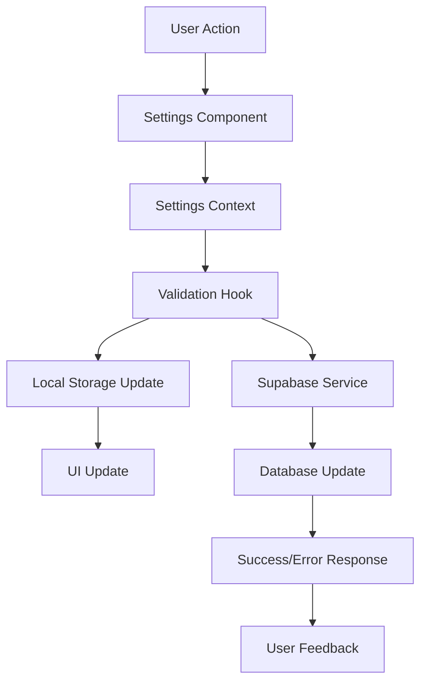

# MaxNote Settings Page Architecture

## Overview

This document outlines the comprehensive architecture for a professional Settings page for the MaxNote application. The design follows existing patterns in MaxNote, using the same tech stack (React, TypeScript, Tailwind CSS, Supabase) and integrates seamlessly with existing contexts like ThemeContext and AuthContext.

## Table of Contents

1. [Architecture Analysis](#architecture-analysis)
2. [Settings Page Structure](#settings-page-structure)
3. [Component Architecture](#component-architecture)
4. [State Management](#state-management)
5. [Data Persistence Strategy](#data-persistence-strategy)
6. [User Interface Design](#user-interface-design)
7. [Implementation Phases](#implementation-phases)
8. [Technical Specifications](#technical-specifications)

## Architecture Analysis

### Current Application Integration Points

Based on analysis of the MaxNote application, the following integration points have been identified:

1. **AuthContext Integration**: User profile management, authentication state
2. **ThemeContext Integration**: Theme preferences, dark/light mode settings
3. **Supabase Services**: User data storage, file uploads, authentication
4. **Routing System**: Navigation to settings page
5. **Layout Component**: Integration with existing layout structure
6. **Sidebar Component**: Settings navigation item

### Existing Patterns to Follow

1. **Component Structure**: Modular components with clear responsibilities
2. **State Management**: Context-based state management with custom hooks
3. **Styling**: Tailwind CSS with consistent design system
4. **Data Flow**: Service layer for API interactions
5. **Type Safety**: TypeScript interfaces for all data structures
6. **Error Handling**: Consistent error handling patterns

## Settings Page Structure

### Navigation Architecture

The Settings page will use a tabbed navigation system with breadcrumb support:

```
Settings
├── Profile
│   ├── Personal Information
│   ├── Avatar Management
│   ├── Activity History
│   └── Privacy Settings
├── System
│   ├── Appearance
│   ├── Language & Region
│   ├── Notifications
│   ├── Data Sync
│   └── Backup & Restore
├── Data Management
│   ├── Export Data
│   ├── Storage Management
│   └── Account Deletion
├── Accessibility
│   ├── Display Settings
│   ├── Keyboard Shortcuts
│   └── Screen Reader Support
└── About
    ├── App Information
    ├── License
    ├── Credits
    └── Changelog
```

### URL Structure

- `/settings` - Main settings page (redirects to profile)
- `/settings/profile` - Profile settings
- `/settings/system` - System settings
- `/settings/data` - Data management
- `/settings/accessibility` - Accessibility settings
- `/settings/about` - About section

## Component Architecture

### Main Components

#### 1. SettingsPage Component
```typescript
// src/pages/Settings.tsx
interface SettingsPageProps {
  defaultTab?: string;
}

export const SettingsPage: React.FC<SettingsPageProps> = ({ defaultTab = 'profile' }) => {
  // Main settings page implementation
};
```

#### 2. SettingsLayout Component
```typescript
// src/components/settings/SettingsLayout.tsx
interface SettingsLayoutProps {
  children: React.ReactNode;
  activeTab: string;
  onTabChange: (tab: string) => void;
}

export const SettingsLayout: React.FC<SettingsLayoutProps> = ({ children, activeTab, onTabChange }) => {
  // Layout with sidebar navigation and breadcrumbs
};
```

#### 3. Tab Components

##### ProfileTab Component
```typescript
// src/components/settings/tabs/ProfileTab.tsx
export const ProfileTab: React.FC = () => {
  // Profile management interface
};
```

##### SystemTab Component
```typescript
// src/components/settings/tabs/SystemTab.tsx
export const SystemTab: React.FC = () => {
  // System settings interface
};
```

##### DataTab Component
```typescript
// src/components/settings/tabs/DataTab.tsx
export const DataTab: React.FC = () => {
  // Data management interface
};
```

##### AccessibilityTab Component
```typescript
// src/components/settings/tabs/AccessibilityTab.tsx
export const AccessibilityTab: React.FC = () => {
  // Accessibility settings interface
};
```

##### AboutTab Component
```typescript
// src/components/settings/tabs/AboutTab.tsx
export const AboutTab: React.FC = () => {
  // About section interface
};
```

### Sub-Components

#### Profile Management Components

##### PersonalInfoForm Component
```typescript
// src/components/settings/profile/PersonalInfoForm.tsx
interface PersonalInfoFormProps {
  user: AuthUser;
  onUpdate: (updates: Partial<AuthUser>) => void;
  loading?: boolean;
}

export const PersonalInfoForm: React.FC<PersonalInfoFormProps> = ({ user, onUpdate, loading }) => {
  // Form for editing personal information
};
```

##### AvatarUpload Component
```typescript
// src/components/settings/profile/AvatarUpload.tsx
interface AvatarUploadProps {
  currentAvatar?: string;
  onUpload: (file: File) => Promise<void>;
  onRemove: () => Promise<void>;
  loading?: boolean;
}

export const AvatarUpload: React.FC<AvatarUploadProps> = ({ currentAvatar, onUpload, onRemove, loading }) => {
  // Avatar upload and management interface
};
```

##### ActivityHistory Component
```typescript
// src/components/settings/profile/ActivityHistory.tsx
export const ActivityHistory: React.FC = () => {
  // User activity history display
};
```

##### PrivacySettings Component
```typescript
// src/components/settings/profile/PrivacySettings.tsx
export const PrivacySettings: React.FC = () => {
  // Privacy preferences management
};
```

#### System Settings Components

##### AppearanceSettings Component
```typescript
// src/components/settings/system/AppearanceSettings.tsx
export const AppearanceSettings: React.FC = () => {
  // Theme, font size, and display preferences
};
```

##### LanguageRegionSettings Component
```typescript
// src/components/settings/system/LanguageRegionSettings.tsx
export const LanguageRegionSettings: React.FC = () => {
  // Language and timezone settings
};
```

##### NotificationSettings Component
```typescript
// src/components/settings/system/NotificationSettings.tsx
export const NotificationSettings: React.FC = () => {
  // Notification preferences management
};
```

##### DataSyncSettings Component
```typescript
// src/components/settings/system/DataSyncSettings.tsx
export const DataSyncSettings: React.FC = () => {
  // Data synchronization preferences
};
```

##### BackupRestoreSettings Component
```typescript
// src/components/settings/system/BackupRestoreSettings.tsx
export const BackupRestoreSettings: React.FC = () => {
  // Backup and restore functionality
};
```

#### Data Management Components

##### DataExport Component
```typescript
// src/components/settings/data/DataExport.tsx
export const DataExport: React.FC = () => {
  // Data export functionality (JSON, PDF)
};
```

##### StorageManagement Component
```typescript
// src/components/settings/data/StorageManagement.tsx
export const StorageManagement: React.FC = () => {
  // Storage usage and management
};
```

##### AccountDeletion Component
```typescript
// src/components/settings/data/AccountDeletion.tsx
export const AccountDeletion: React.FC = () => {
  // Account deletion process
};
```

#### Accessibility Components

##### DisplaySettings Component
```typescript
// src/components/settings/accessibility/DisplaySettings.tsx
export const DisplaySettings: React.FC = () => {
  // Font size, contrast, and display accessibility
};
```

##### KeyboardShortcuts Component
```typescript
// src/components/settings/accessibility/KeyboardShortcuts.tsx
export const KeyboardShortcuts: React.FC = () => {
  // Keyboard shortcuts configuration
};
```

##### ScreenReaderSupport Component
```typescript
// src/components/settings/accessibility/ScreenReaderSupport.tsx
export const ScreenReaderSupport: React.FC = () => {
  // Screen reader compatibility settings
};
```

#### About Components

##### AppInfo Component
```typescript
// src/components/settings/about/AppInfo.tsx
export const AppInfo: React.FC = () => {
  // Application version and information
};
```

##### LicenseInfo Component
```typescript
// src/components/settings/about/LicenseInfo.tsx
export const LicenseInfo: React.FC = () => {
  // License information display
};
```

##### Credits Component
```typescript
// src/components/settings/about/Credits.tsx
export const CreditsComponent: React.FC = () => {
  // Application credits and acknowledgments
};
```

##### Changelog Component
```typescript
// src/components/settings/about/Changelog.tsx
export const ChangelogComponent: React.FC = () => {
  // Application changelog display
};
```

### Shared Components

#### SettingsCard Component
```typescript
// src/components/settings/shared/SettingsCard.tsx
interface SettingsCardProps {
  title: string;
  description?: string;
  children: React.ReactNode;
  className?: string;
}

export const SettingsCard: React.FC<SettingsCardProps> = ({ title, description, children, className }) => {
  // Reusable card component for settings sections
};
```

#### SettingsSection Component
```typescript
// src/components/settings/shared/SettingsSection.tsx
interface SettingsSectionProps {
  title: string;
  description?: string;
  children: React.ReactNode;
  actions?: React.ReactNode;
}

export const SettingsSection: React.FC<SettingsSectionProps> = ({ title, description, children, actions }) => {
  // Reusable section component with title and actions
};
```

#### SettingsToggle Component
```typescript
// src/components/settings/shared/SettingsToggle.tsx
interface SettingsToggleProps {
  label: string;
  description?: string;
  checked: boolean;
  onChange: (checked: boolean) => void;
  disabled?: boolean;
}

export const SettingsToggle: React.FC<SettingsToggleProps> = ({ label, description, checked, onChange, disabled }) => {
  // Toggle switch for boolean settings
};
```

#### SettingsSelect Component
```typescript
// src/components/settings/shared/SettingsSelect.tsx
interface SettingsSelectProps {
  label: string;
  description?: string;
  value: string;
  options: { value: string; label: string }[];
  onChange: (value: string) => void;
  disabled?: boolean;
}

export const SettingsSelect: React.FC<SettingsSelectProps> = ({ label, description, value, options, onChange, disabled }) => {
  // Select dropdown for settings with multiple options
};
```

#### SettingsInput Component
```typescript
// src/components/settings/shared/SettingsInput.tsx
interface SettingsInputProps {
  label: string;
  description?: string;
  value: string;
  onChange: (value: string) => void;
  type?: 'text' | 'email' | 'password' | 'tel';
  placeholder?: string;
  disabled?: boolean;
  error?: string;
}

export const SettingsInput: React.FC<SettingsInputProps> = ({ label, description, value, onChange, type, placeholder, disabled, error }) => {
  // Text input for settings
};
```

#### SettingsButton Component
```typescript
// src/components/settings/shared/SettingsButton.tsx
interface SettingsButtonProps {
  children: React.ReactNode;
  variant?: 'primary' | 'secondary' | 'danger';
  onClick: () => void;
  loading?: boolean;
  disabled?: boolean;
  className?: string;
}

export const SettingsButton: React.FC<SettingsButtonProps> = ({ children, variant, onClick, loading, disabled, className }) => {
  // Reusable button component for settings actions
};
```

#### ConfirmDialog Component
```typescript
// src/components/settings/shared/ConfirmDialog.tsx
interface ConfirmDialogProps {
  open: boolean;
  title: string;
  description: string;
  confirmText?: string;
  cancelText?: string;
  onConfirm: () => void;
  onCancel: () => void;
  variant?: 'default' | 'danger';
}

export const ConfirmDialog: React.FC<ConfirmDialogProps> = ({ open, title, description, confirmText, cancelText, onConfirm, onCancel, variant }) => {
  // Confirmation dialog for critical actions
};
```

## State Management

### SettingsContext

A new context will be created to manage settings state:

```typescript
// src/context/SettingsContext.tsx
interface UserSettings {
  // Profile settings
  displayName: string;
  bio: string;
  phone: string;
  
  // System settings
  language: string;
  timezone: string;
  notifications: {
    push: boolean;
    email: boolean;
    inApp: boolean;
  };
  autoSync: boolean;
  autoBackup: boolean;
  
  // Accessibility settings
  fontSize: 'small' | 'medium' | 'large';
  highContrast: boolean;
  reduceMotion: boolean;
  screenReader: boolean;
  
  // Data settings
  exportFormat: 'json' | 'pdf' | 'csv';
  retentionDays: number;
}

interface SettingsContextType {
  settings: UserSettings;
  loading: boolean;
  error: string | null;
  updateSettings: (updates: Partial<UserSettings>) => Promise<void>;
  resetSettings: () => Promise<void>;
  exportSettings: () => Promise<void>;
  importSettings: (data: any) => Promise<void>;
}

export const SettingsProvider: React.FC<{ children: React.ReactNode }> = ({ children }) => {
  // Settings context implementation
};

export const useSettings = (): SettingsContextType => {
  // Hook to use settings context
};
```

### Custom Hooks

#### useSettingsPersistence Hook
```typescript
// src/hooks/useSettingsPersistence.ts
export const useSettingsPersistence = () => {
  // Hook for persisting settings to localStorage and Supabase
};
```

#### useSettingsValidation Hook
```typescript
// src/hooks/useSettingsValidation.ts
export const useSettingsValidation = () => {
  // Hook for validating settings inputs
};
```

#### useSettingsSearch Hook
```typescript
// src/hooks/useSettingsSearch.ts
export const useSettingsSearch = () => {
  // Hook for searching through settings
};
```

## Data Persistence Strategy

### Storage Layers

1. **Local Storage**: For immediate UI state and temporary settings
2. **Supabase**: For persistent user settings and preferences
3. **Session Storage**: For temporary state during session

### Data Flow



### Settings Schema

```typescript
// Database schema for user_settings table
interface UserSettingsTable {
  id: string;
  user_id: string; // Foreign key to auth.users
  settings_data: UserSettings; // JSON object with all settings
  created_at: string;
  updated_at: string;
}
```

### Sync Strategy

1. **Initial Load**: Load settings from Supabase on app start
2. **Real-time Updates**: Sync changes immediately to Supabase
3. **Conflict Resolution**: Last-write-wins with user confirmation for critical changes
4. **Offline Support**: Queue changes when offline, sync when online

## User Interface Design

### Design System Integration

The Settings page will follow the existing MaxNote design system:

- **Colors**: Primary teal (#14b8a6), gray scales, semantic colors
- **Typography**: Consistent font sizes and weights
- **Spacing**: Consistent spacing using Tailwind classes
- **Components**: Reusable components with consistent styling
- **Icons**: Lucide React icons for consistency

### Responsive Design

- **Mobile (< 768px)**: Single column layout, collapsible sections
- **Tablet (768px - 1024px)**: Two-column layout with sidebar
- **Desktop (> 1024px)**: Three-column layout with fixed sidebar

### Accessibility Features

- **Keyboard Navigation**: Full keyboard support with tab indexing
- **Screen Reader**: Proper ARIA labels and descriptions
- **High Contrast**: High contrast mode support
- **Focus Management**: Clear focus indicators and logical tab order
- **Reduced Motion**: Respect prefers-reduced-motion setting

### Visual Feedback

- **Loading States**: Skeleton loaders and spinners
- **Success States**: Toast notifications and visual confirmations
- **Error States**: Clear error messages and recovery options
- **Progress Indicators**: Progress bars for long-running operations

## Implementation Phases

### Phase 1: Foundation (Week 1)
1. Create SettingsContext and basic state management
2. Implement SettingsLayout with navigation
3. Create shared components (SettingsCard, SettingsToggle, etc.)
4. Set up routing for settings page
5. Basic profile tab implementation

### Phase 2: Core Features (Week 2)
1. Complete profile management (personal info, avatar upload)
2. Implement system settings (theme, language, notifications)
3. Add data persistence to Supabase
4. Create validation and error handling
5. Implement search functionality

### Phase 3: Advanced Features (Week 3)
1. Data management features (export, storage)
2. Accessibility settings implementation
3. About section with app information
4. Advanced notification settings
5. Backup and restore functionality

### Phase 4: Polish & Optimization (Week 4)
1. Performance optimization
2. Comprehensive testing
3. Accessibility audit and improvements
4. Mobile responsiveness refinement
5. Documentation and deployment

## Technical Specifications

### File Structure

```
src/
├── components/settings/
│   ├── SettingsLayout.tsx
│   ├── tabs/
│   │   ├── ProfileTab.tsx
│   │   ├── SystemTab.tsx
│   │   ├── DataTab.tsx
│   │   ├── AccessibilityTab.tsx
│   │   └── AboutTab.tsx
│   ├── profile/
│   │   ├── PersonalInfoForm.tsx
│   │   ├── AvatarUpload.tsx
│   │   ├── ActivityHistory.tsx
│   │   └── PrivacySettings.tsx
│   ├── system/
│   │   ├── AppearanceSettings.tsx
│   │   ├── LanguageRegionSettings.tsx
│   │   ├── NotificationSettings.tsx
│   │   ├── DataSyncSettings.tsx
│   │   └── BackupRestoreSettings.tsx
│   ├── data/
│   │   ├── DataExport.tsx
│   │   ├── StorageManagement.tsx
│   │   └── AccountDeletion.tsx
│   ├── accessibility/
│   │   ├── DisplaySettings.tsx
│   │   ├── KeyboardShortcuts.tsx
│   │   └── ScreenReaderSupport.tsx
│   ├── about/
│   │   ├── AppInfo.tsx
│   │   ├── LicenseInfo.tsx
│   │   ├── Credits.tsx
│   │   └── Changelog.tsx
│   └── shared/
│       ├── SettingsCard.tsx
│       ├── SettingsSection.tsx
│       ├── SettingsToggle.tsx
│       ├── SettingsSelect.tsx
│       ├── SettingsInput.tsx
│       ├── SettingsButton.tsx
│       └── ConfirmDialog.tsx
├── context/
│   └── SettingsContext.tsx
├── hooks/
│   ├── useSettingsPersistence.ts
│   ├── useSettingsValidation.ts
│   └── useSettingsSearch.ts
├── services/
│   └── settingsService.ts
├── types/
│   └── settings.ts
└── pages/
    └── Settings.tsx
```

### Type Definitions

```typescript
// src/types/settings.ts
export interface UserSettings {
  // Profile settings
  displayName: string;
  bio: string;
  phone: string;
  avatarUrl?: string;
  
  // System settings
  theme: 'light' | 'dark' | 'system';
  language: string;
  timezone: string;
  notifications: NotificationSettings;
  autoSync: boolean;
  autoBackup: boolean;
  
  // Accessibility settings
  fontSize: 'small' | 'medium' | 'large';
  highContrast: boolean;
  reduceMotion: boolean;
  screenReader: boolean;
  
  // Data settings
  exportFormat: 'json' | 'pdf' | 'csv';
  retentionDays: number;
}

export interface NotificationSettings {
  push: boolean;
  email: boolean;
  inApp: boolean;
  reminders: boolean;
  updates: boolean;
}

export interface ActivityLog {
  id: string;
  action: string;
  timestamp: string;
  details?: string;
  category: 'profile' | 'system' | 'data' | 'accessibility';
}

export interface StorageInfo {
  total: number;
  used: number;
  available: number;
  breakdown: {
    notes: number;
    tasks: number;
    events: number;
    jots: number;
    attachments: number;
  };
}
```

### Service Layer

```typescript
// src/services/settingsService.ts
export const settingsService = {
  async getUserSettings(userId: string): Promise<{ data: UserSettings | null; error: string | null }> {
    // Fetch user settings from database
  },
  
  async updateUserSettings(userId: string, settings: Partial<UserSettings>): Promise<{ success: boolean; error: string | null }> {
    // Update user settings in database
  },
  
  async exportUserData(userId: string, format: 'json' | 'pdf'): Promise<{ url: string | null; error: string | null }> {
    // Export user data in specified format
  },
  
  async getStorageUsage(userId: string): Promise<{ data: StorageInfo | null; error: string | null }> {
    // Get storage usage information
  },
  
  async deleteAccount(userId: string): Promise<{ success: boolean; error: string | null }> {
    // Delete user account and all associated data
  }
};
```

### Performance Considerations

1. **Lazy Loading**: Load settings tabs on demand
2. **Debouncing**: Debounce input changes to reduce API calls
3. **Caching**: Cache frequently accessed settings
4. **Optimistic Updates**: Update UI immediately, sync in background
5. **Bundle Splitting**: Separate settings bundle for better loading performance

### Security Considerations

1. **Input Validation**: Validate all user inputs
2. **Permission Checks**: Ensure users can only access their own settings
3. **Data Sanitization**: Sanitize data before storage
4. **Rate Limiting**: Implement rate limiting for sensitive operations
5. **Audit Logging**: Log all settings changes for security

## Conclusion

This architecture provides a comprehensive, scalable, and maintainable approach to implementing a professional Settings page for MaxNote. The design follows existing patterns in the application while introducing new features and capabilities that enhance the user experience.

The modular component structure, clear separation of concerns, and robust state management ensure that the Settings page will be easy to maintain and extend in the future. The responsive design and accessibility features ensure that all users can effectively manage their preferences and settings.

The phased implementation approach allows for incremental development and testing, ensuring a high-quality final product that meets the requirements of the MaxNote application.